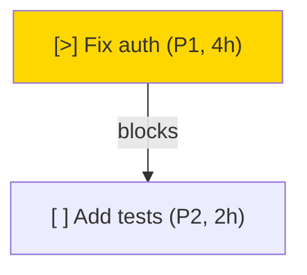

# Dependency Graph Visualization

Generate visual dependency diagrams in Mermaid or Graphviz DOT format.

## Mermaid (default)

```bash
slate graph                          # all tasks
slate graph --task st-ab12           # scoped to task's subtree
```

Output:


Paste into GitHub markdown, Notion, or any Mermaid renderer.

## Graphviz DOT

```bash
slate graph --output dot             # DOT format
slate graph --output dot | dot -Tpng -o graph.png  # render to PNG
```

## Critical Path Analysis

```bash
slate next --critical-path           # full analysis
slate next --critical-path --json    # JSON output
```

Shows:
- **Critical path**: longest chain of blocking dependencies (weighted by estimate)
- **Bottlenecks**: tasks that unblock the most downstream work
- **Parallelizable**: independent tasks with no mutual dependencies

Tasks without estimates use the median estimate for their task type as fallback.
